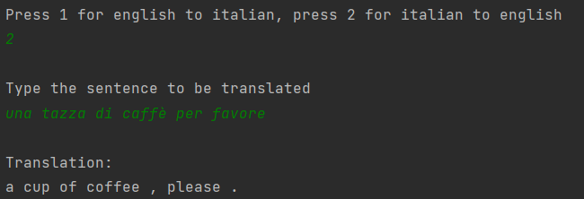
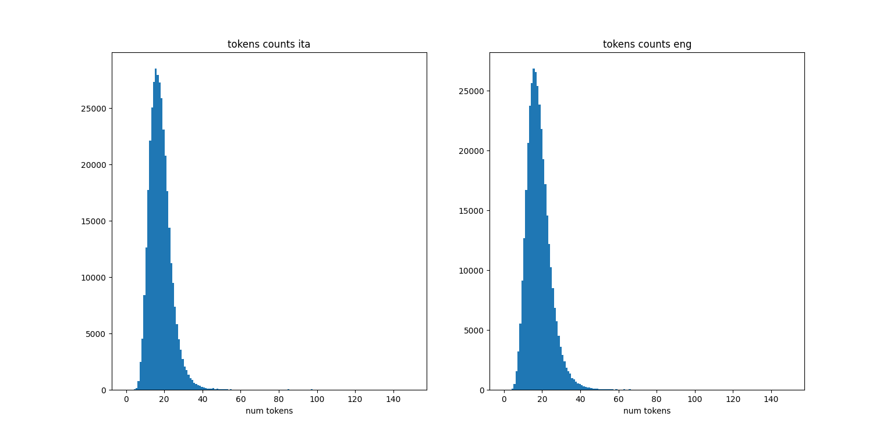
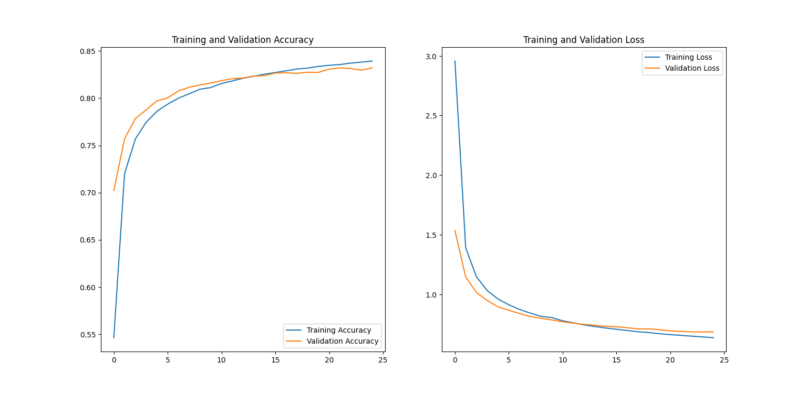
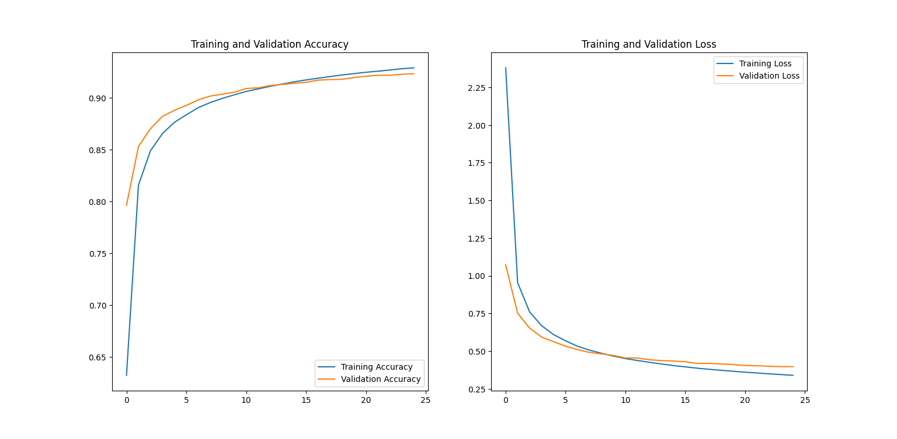

# Italian - English machine translation

Implementation of a transformer model for neural machine translation (NMT) between english and italian.

The dataset used is from the [tatoeba project](http://www.manythings.org/anki/), where a lot more datasets 
can be found.
Every dataset formatted as 

```
#language 1 language 2
sentence    translation
sentence    translation
...
```

i.e. sentences and translations separated by a tab character although others separators will work with the
the right modifications in the loading functions in `prepro.py`



## Contents

* **models** contains the transformer model and all subsequent blocks
* **prepro.py** contains some utility functions in order to load and preprocess the dataset to be used
* **tokenization.py** contains function to build the vocabulary from the datasets (already saved in the **data** folder) and the class 
for the custom tokenizers (already given as saved models in the **tokenizers** folder)
* **tokenizers** contains the tokenizers saved as a model
* **export.py** contains the classes used in order to save the model as a stand alone
* **train.py** is a script for the training and saving of the models. 
In order to reverse the order of the languages 
one has to just invert the order of `dataset1` and `dataset2` in the output of the `np.loadtxt` function in `get_dataset`
inside `prepro.py` and switch the tokenizers in the `get_batches` function called in `train.py`
* **utilis.py** contains the implementation of the custom learning rate, loss and metric used in the 
[original article](https://arxiv.org/abs/1706.03762)
* **translator.py** is a script to try the trained model on a (short) sentence given from the terminal
* **data** contains the used dataset and vocabularies (that can be rebuilt with the functions in `tokenization.py`)

The trained models are available at [for the italian to english](https://drive.google.com/drive/folders/17X_yEWHAD5RLUpJbSAymKDWI9Mwsm2iP?usp=sharing) and [for the english to italian](https://drive.google.com/drive/folders/1Ax7CrBhOE-Q8s0X9NrE6RnQFGMFgi6h6?usp=sharing)

## Tokenization

The tokenizer used is the BERT tokenizer, implemented in a custom class in order to be saved and reloaded.

In order to decide the maximum number of tokens to use the number of tokens per sentence has been plotted as
an histogram:



and clearly the great majority of sentences doesn' t contains more than 65 tokens in both languages

## Results

The model has been trained with the hyperparameters given in the [original article](https://arxiv.org/abs/1706.03762) on a 
RTX 3070 (~7 min per epoch) for 20 epochs obtaining the following results

 

## TODO

The next thing to look for could be how to speed up inference and how to output estetically pleasing translations (e.g. the modell will output
every character separated by a space such as "i ' m going to school" insted of "i'm going to school"), making 
sure it considers capital letters and abbreviations su as 'Mr.' or 'Ms.' and doesn't put spaces before the comma such as
"yes, please" isnted of "yes , please"
